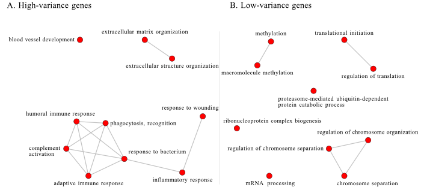

# Abstract

# Intro

Molecular phenotypes such as gene expression are a powerful tool for understanding physiology, disease, and evolutionary adaptations.
In this context, average trait values are usually the focus of investigation, while variation is treated as a nuisance [@De_Jong2019-po].
However, gene expression variation can be directly involved in determining fitness [@Fraser2004-sv; @Wang2011-ts], and changes in the associations between gene expression can be indicative of disease, even in the absence of changes in mean expression [@Lea2019-pq].
From an evolutionary perspective, the availability of gene expression variation is what allows evolutionary change, and the genetic architecture of gene expression variation can also evolve [@Bruijning2020-bf].
Understanding the landscape of gene expression variation, and how variable it is across genes and across human populations is then a neglected avenue to understand biological evolution and our relation to the environment.

The evolution of trait variation is still a poorly understood phenomena [@Hansen2011-es], and several competing forces act to shape gene expression variation [@Houle1998-mj; @Bruijning2020-bf].
From a genomic perspective, we expect the influx of new mutations to increase observed variation, while the selective removal of polymorphisms, via purifying selection or selective sweeps, would decrease variation.
From a trait-centric perspective, stabilizing selection should decrease variation around an optimal value, and directional selection can lead to transient increase in variation while selected alleles sweep to fixation, followed by a reduction in variation as these alleles become fixed.
This simple picture is complicated by epistatic interactions between loci and other aspects of genetic architecture.
For example, pleiotropic effects allow selection on one trait to influence the variation of other traits, potentially limiting the direct response to selection [@Wagner1997-hw; @Pavlicev2011-xm].
Epistatic interactions can also alter the distribution of genetic variation across traits, leading to feedback between selection and genetic architecture [@Pavlicev2015-up; @Penna2017-if].
These types of interactions can lead to complicated dynamics [@Wolf2001-fm].
The indirect effect of directional selection on variation opens the possibility that the main driver of gene expression variation is not direct selection on variation but indirect effects due to selection on trait means [@Hansen2011-es].
Furthermore, gene by environment (GxE) interactions can also lead to changes in the observed phenotypic variation of gene expression, further complicating the landscape of variation.
To what extent these different processes shape gene expression variation is an open question.
Can we expect the pattern of genetic variation across populations to be similar? Which genes are expected to differ more or less in their variation? Which genes are expected to be more or less variable?

__Canalization paragraph__: In general, if traits are under stabilizing selection, we expect that any deviation from the optimal level of expression is a cost, and gene variants that increase the phenotypic variation should be selected against.
Alternatively, the phenotypic variation can become canalized, that is, robust to genetic variation that would otherwise lead to increased phenotypic variation.
Canalization can also refer to robustness in relation to environmental perturbations, and canalized genes are expected to have less variable expression levels across environments.
The conditions in which we expect canalization to evolve are somewhat limited [@Flatt2005-da; @Hansen2011-es; @Proulx2005-ko].

__What we did__: Here, we use public gene expression data sets to evaluate how the differences in gene expression variation is structured across independent samples.
We collected and compared the gene expression variation across several studies, and used the similarities across these studies to create a gene expression variation ranking, which orders genes from least variable to most variable.
We then explore the expected drivers of this gene expression ranking, showing that both cis and trans regulation are involved with the determination of gene expression variance.
Finally, we explored the link between gene expression variation and biological function by leveraging gene ontology annotations.

# Results

Gene expression standard deviations (SD) were calculated for each data set using a single pipeline that normalized the mean-variance relation in count data, controlled for batch effects, and removed outliers (see methods for details).
Spearman correlations ($\rho_s$) between gene expression SD reveal a broadly similar rank of gene expression variation, so genes that are most variable in one study tend to be most variable in all studies ([@fig:sd_corr]A).
A principal coordinate analysis using $|1 - \rho_s|$ as a distance measure does not show clearly delineated groups, but gTEX and TCGA studies are clustered among themselves and close together.
This indicates some effect of study source on the similarity between gene expression SD across studies, which we explore in detail bellow.
Observed range of gene expression SD across genes is variable across studies, but can be normalized so that the distributions are comparable ([@fig:sd_corr]C).
Given that the correlations across studies are broadly high, indicating similar ordering of the genes, we seek to summarize the differences in variation across genes by using a single rank, averaging the ordering across all studies.
To create this rank, we use the score of each gene in the first principal component of the Spearman correlation matrix.
This generates a ranked list of genes, with most variable genes having highest rank.
The red and blue ticks at the bottom of [@fig:sd_corr]C show the positions on the standard deviation distributions of the least and most variable genes in our variation rank.

{#fig:sd_corr width=80% }

__Modeling across study SD correlations:__ To characterize the drivers of across study similarity, we directly model the correlations across studies using a mixed effect linear model [@Dias2021-wk; @Dias2021-hb].
This modeling ([@fig:corr_model]) shows that comparisons of studies within gTEX and TCGA have on average higher values of $\rho_s$, but also that comparing studies across gTEX and TCGA also shows a similar increase in the average correlation ([@fig:corr_model]C).
Since these two sources are independent, this effect on the similarities could be due to the quality of the data coming from these two large projects.
Tissue also affect the similarity between gene expression SD, with studies using the same tissue being  on average more similar ([@fig:corr_model]B).
The largest effects on the correlations are those associated with individual studies, in particular some specific tissues, i.e., comparisons involving bone marrow (from gTEX) and study SRP057500 (which used platelets) are on average lower ([@fig:corr_model]A).
These studies also show up further away in the PCoA plot in [@fig:sd_corr]B.

![Coefficients estimates from a linear model using the among studies Spearman correlations as the response variable. These correlations are shown in [@fig:sd_corr]A. In the linear model, correlations are Fisher z-transformed. Study source and tissue are added as fixed effects. Coefficient estimates are shown with 50% and 95% credibility intervals. Panel A: The per-study random effect captures the non-independence of the correlation values and estimates the characteristic contribution of each study to the correlation. For example: comparisons involving bone marrow (from gTEX) tend to be lower than the others. Panels B and C: Fixed effect estimates: correlations among studies that use the same tissue are higher, and correlations involving studies in the \"Other\" category (non gTEX and TCGA) tend to be lower, while comparison involving gTEX and TCGA are higher.](figures/correlationModeling.png){#fig:corr_model width=80%}

## Gene Ontology enrichment

We explore the relation between variation and function by using the tails of our variance rank to perform a Gene Ontology (GO) enrichment analysis.
Among the 5% most variable genes we observe enrichment for immune function (@fig:go_tails, left), and  enrichment for house keeping genes among the 5% least variable genes (@fig:go_tails, right).
This suggests clear influence of selection and gene by environment interactions in the determination of gene expression variance.

{#fig:go_tails width=75% }

## Gene level statistics

We use populational and evolutionary gene-level statistics to link processes that potentially influence variation in gene expression to the observed variation rank.
We focus on 3 gene-level measures: nucleotide diversity, (substitutions?), and gene expression connectivity.
Diversity is 
used as a proxy for cis-regulation sites, and we expect variation to increase with diversity.
Connectivity, a proxy for regulatory interactions with other genes, in turn, should be negatively correlated with variation, as highly connected genes are expected to be more constrained in their variability.
Finally, $d_{XY}$....
All of these patterns can be seen in [@fig:gene_stats] and are consistent with our expectations.
We also use linear models to measure the association between rank and these statistics while accounting for the effect of mean expression.
The strongest effect was of... (stats), followed by ...(stats), and  ... (stats).

We should add $d_{XY}$

{#fig:gene_stats width=50% }

## Disease stuff??

Scott? I don´t remember what was the final shape of this.

\newpage

# Discussion

Gene expression variation is a largely unexplored aspect of molecular phenotypes.
By using large publicly available data sets, we were able to show that gene expression variance is reasonably conserved across studies.
Differences in gene expression variation were driven by technical aspects of gene expression measurement, with data derived from large consortium showing more similar patters on variation across genes; and to tissue, with studies using the same tissues also showing higher similarities.
However, the largest driver of differences across studies was idiosyncratic differences related to single data sets, with tissues know to have divergent gene expression patterns (i.e.
bone marrow, blood, testis, and platelets) also showing the largest differences in gene expression variation.
Differences in variation are informative in excess of the differences in mean expression: it is not just that more expressed genes are more variable, residual differences in gene expression variation also carry information about tissue specific patterns.

While these observed differences are notable, we also find a broadly similar pattern of gene expression variation across studies, with high correlations between gene expression variation cross most studies (75% of correlations are between 0.45 and 0.9).
Leveraging this similarity between gene expression variation across studies, we used a standard multivariate strategy to create a single rank of expression variation, which allowed us to order almost 13k genes according to their gene expression variation.
This rank is associated with within gene genetic variation, with more polimorphic genes being more variable.
Conversely, genes with high connectivity, those with higher levels of gene expression correlations with other genes, are less variable. 

Lines of evidence point to a selective strucuturing of gene expression variation. Stabilizing and purifying selection are consistent. Likewise, constrained genes, with high connectivity, also less variable. Furthermore, this ordering is linked to function and interacting with the environment, suggesting a role for disruptive selection.

Gene expression variance is predictive of biological function.
High and low variance genes are enriched for terms that are consistent with base organismal functions and gene x environment interactions.
How do different GO terms differ in their underlying variation?
Differences in gene expression variance can be driven by experimental features, so care must be taken when designing experiments focused on finding gene expression differences.
Tissue differences in gene expression variance are an unexplored field.
Gene expression variance can be partially explained by genetic variation and genetic associations between gene expression.

Funcional stuff? I'm missing what the functional mapping is giving us.

\Begin{multicols}{2}
\footnotesize 

# Methods

## Data sources

We selected 60 studies with large sample sizes from public gene expression repositories recount3 [@Wilks2021-uj] and Expression Atlas [@Papatheodorou2020-dn].
We use studies to refer to independent data sets, which could have been generated by the same consortium.
For example, the gTEX data are separated by tissue, and we refer to each tissue as a separate study.

## Data processing pipeline

We use a standardized pipeline to measure gene expression variation while removing extraneous sources of variation.
Data from Case-control studies was filtered to keep only control samples.

For each study, we filtered genes that did not achieve a minimum of 1 count per million (cpm) reads in all samples and a mean 5 cpm reads.
To account for the mean variance relation in count data, remaining genes were subjected to the variance stabilizing transformation implemented in DESeq2 [@Love2014-mp].
Fixed effects were manually curated from the metadata for all studies and removed using a linear fixed effect model.
Outlier individuals in the residual distribution were removed using a robust PCA approach of automatic outlier detection [@Chen2020-fy].
Gene expression standard deviation is measured in the residuals after fixed effect correction and outlier removal.

## Variance correlation

We assessed the similarity in gene expression variation across studies by using a between study Spearman correlation matrix of the measured standard deviations.
Using Spearman correlations avoid problems related to overall scaling or coverage differences, and allows us to assess if the same genes are usually more or less variable across studies.
To investigate the factors involved in determining correlations between studies, we used a varying effects model to investigate the effect of study origin and tissue on the correlations across studies.
This model is designed to take the non-independent nature of a set of correlations into account when modeling the correlation between gene expression variation.
This is accomplished by adding a per-study random effect, see [@Dias2021-hb] for details.
Given that most of the variation in the Spearman correlation across studies is explained by a single principal component, we use the ranked projections of gene expression variance in this principal component to create an across study rank of gene variation.
The higher the rank, the higher the gene standard deviation of a given gene.
Genes that were expressed in at least 50% of the studies were included in the rank.

## Gene level statistics

__Genetic variation__: Genetic variation measures were obtained from the PopHuman project, which provides a comprehensive set of genomic information for human populations derived from the 1000 Genomes Project.
Gene level metrics were used when available.
If only window based metrics are available, we assembled gene level information from 5kb window tracks where each window that overlaps with a given gene was assigned to the gene and the mean metric value is reported.
In parallel, we use the PopHumanScan data set, which expands PopHuman by compiling and annotating regions under selection.
Similarly, we used gene level information when possible, and for tracks with only window based metrics, gene level information was assembled from the 10kb windows using the same assignment method described above.
Nucleotide diversity ($\pi$), the average pairwise number of differences per site among the chromosomes in a population [@Nei1979-hg], provides insight in the genetic diversity within a population, in this case CEU population within 1000 genomes.
The nucleotide diversity can also be used as an estimator of the central population genetic parameter, normally given as $\Theta$.

__Gene connectivity__: As a proxy for the degree of trans regulation that each gene is subjected to, we calculate the average weighted connectivity for all genes.
To do this, for each study, we create a fully connected gene-by-gene graph in which each edge is weighted by the Spearman correlation between gene expression.
We then trim this graph by keeping only edges for which the Spearman correlation is significant at a false discovery rate of 1%.
In this trimmed network, we then take the average of the Spearman correlation of all remaining edges for each gene.
So, for each study we have a measure of the average correlation of each gene with every other gene.
The average connectivity for each gene is the average across all studies in which that gene is expressed.
As a proxy for the degree of trans regulation that each gene is subjected to, we calculate the average weighted connectivity for all genes.
To do this, for each study, we create a fully connected gene-by-gene graph in which each edge is weighted by the Spearman correlation between gene expression.
We then trim this graph by keeping only edges for which the Spearman correlation is significant at a false discovery rate of 1%.
In this trimmed network, we then take the average of the Spearman correlation of all remaining edges for each gene.
So, for each study we have a measure of the average correlation of each gene with every other gene.
The average connectivity for each gene is the average across all studies in which that gene is expressed.

\normalsize
\End{multicols}

# References

