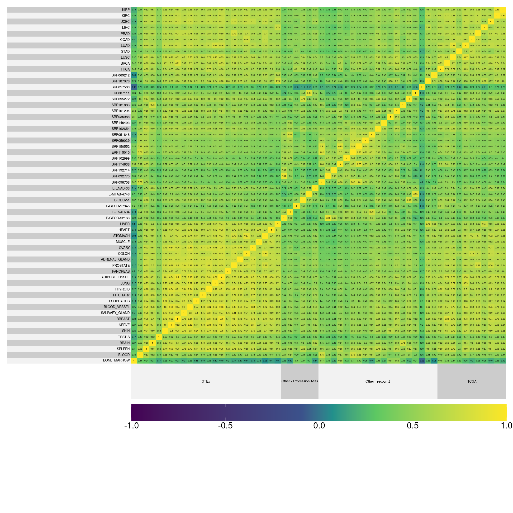

# Abstract

# Intro

Molecular phenotypes such as gene expression are a powerful tool for understanding physiology, disease, and evolutionary adaptations. In this context, average trait values are usually the focus of investigation, while variation is treated as a nuisance [@De_Jong2019-po]. However, gene expression variation can be directly involved in determining fitness [@Fraser2004-sv; @Wang2011-ts], and changes in the associations between gene expression can be indicative of disease, even in the absence of changes in mean expression [@Lea2019-pq]. From an evolutionary perpective, the availability of gene expression variation is what allows evolutionary change, and the genetic architecture of gene expression variation can also evolve [@Bruijning2020-bf]. Understanding the landscape of gene expression variation, and how variable it is across genes and across human populations is then a neglected avenue to understand biological evolution and our relation to the environment.

__What processes affect variation__: The evolution of trait variation is still a poorly understood phenomena[@Hansen2011-es], and several competing forces act to shape gene expression variation [@Houle1998-mj; @Bruijning2020-bf]. From a genomic perspective, we expect the influx of new mutations to increase observed variation, while the selective removal of polymorphisms, via purifuing selection or selective sweeps, would decrease variation. From a trait-centric perspective, stabilizing selection should decrease variation around an optimal value, and directional selection can lead to transient increase in variation while selected alleles sweep to fixation, followed by a reduction in variation as these alleles become fixed. This simple picture is complicated by epistatic interactions between loci and other aspects of gentic architecture. For example, pleiotropic effects allow selection on one trait to influence the variation of other traits, potentially limiting the direct response to selection. Epistatic variation can also alter the availability of genetic variation in the direction of selection [@Pavlicev2015-up]. These types of interactions can lead to complicated dynamics [@Wagner1997-hw; @Wolf2001-fm].  

Trait variation evolution is in part a consequence of trait evolution. The relative importance of indirect effects due to trait evolution and direct effects due to direct selection on variation are unknown. More on the consequences of gene expression variation...

The final observed gene expression variation is the product of several interacting processes, and genes are expected to differ in their gene expression variance due to several factors:

- Directional and stabilizing selection on standing variation
- Mutational target size
- GxG interactions
- GxE interactions
- Canalization and indirect selection on modifiers

Can we expect that the pattern of genetic variation across populations to be similar? Which genes are expected to change more or less? Which genes are expected to be more or less variable?

__Canalization paragraph__: In general, if traits are under stabilizing selection, we expect that any deviation from the optimal level of expression is a cost, and gene variants that increase the phenotypic variation should be selected againts. Alternatively, the phenotypic variation can become canalized, that is, robust to genetic variation that would otherwise lead to increased phenotypic variation. Canalization can also refer to robustness in relation to environmental perturbations, and canalized genes are expected to have less variable expression levels across environments. The conditions in which we expect canalization to evolve are somewhat limited [@Flatt2005-da; @Hansen2011-es; @Proulx2005-ko]. 

__What we did__: Here we use public gene expression data sets to evaluate how the differences in gene expression variation is structured across independent samples. We collected and compared the gene expression variation across several studies, and used the similarities across these studies to create a gene expression variation ranking, which orders genes from least variable to most variable. We then explore the expected drivers of this gene expression ranking, showing that both cis and trans regulation are involved with the determination of gene expression variance. 

# Results

{ width=50% }

## Correlation between variation across studies

{ width=50% }

{ width=50% }

# GO enrichment

{ width=50% }

## Gene level statistics

PopHuman stuff: pi and ... [@Casillas2018-nk]

{ width=50% }

\newpage

# Discussion

Gene expression variance is reasonably conserved across studies.
Gene expression variance is predictive of biological function. High and low variance genes are enriched for terms that are consistent with base organismal functions and gene x environment interactions.
Gene expression variance can be partially explained by genetic variation and genetic associations between gene expression.

Funcional stuff? I'm missing what the functional mapping is giving us.

\Begin{multicols}{2}
\footnotesize 

# Methods

## Data sources

We selected 60 studies with large sample sizes from public gene expression repositories recount3 [@Wilks2021-uj] and Expression Atlas [@Papatheodorou2020-dn]. We use studies to refer to independent data sets, which could have been generated by the same consortium. For example, the gTEX data are separated by tissue, and we refer to each tissue as a separate study. 

## Data processing pipeline

We use a standardized pipeline to measure gene expression variation while removing extraneous sources of variation. Case-control studies were filtered to keep only control samples. 

For each study, we filtered genes that did not achieve a minimum of 1 count per million (cpm) reads in all samples and a mean 5 cpm reads. To account for the mean variance relation in count data, remaining genes were subjected to the variance stabilizing transformation implemented in DESeq2 [@Love2014-mp]. Fixed effects were manually curated from the metadata for all studies and removed using a linear fixed effect model.Outlier individuals in the residual distribution were removed using a robust PCA approach of automatic outlier detection [@Chen2020-fy]. Gene expression standard deviation is measured in the residuals after fixed effect correction and outlier removal.

## Variance correlation

We assessed the similarity in gene expression variation across studies by using a between study Spearman correlation matrix of the measured standard deviations. Using Spearman correlations avoid problems related to overall scaling or coverage differences, and allows us to assess if the same genes are usually more or less variable across studies. To investigate the factors involved in determining correlations between studies, we used a varying effects model to investigate the effect of study origin and tissue on the correlations across studies. Given that most of the variation in the Spearman correlation across studies is expolained by a single principal component, we use the ranked projections of gene expression variance in this principal component to create an across study rank of gene variation. The higher the rank, the higher the gene standard deviation of a given gene. 

## Gene level statistics

__Genetic variation__: We pull genetic variation data from the PopHuman project. The PopHuman project provides a comprehensive set of gene expression data for human populations derived from the 1000 Genomes Project. Where gene level metric are available, they are used. For metrics where only window based metrics are available, metrics are assembled from 5kb window tracks where each window that overlaps with a given gene is assigned to the gene and the mean metric value is reported. In parallel, we use the PopHumanScan dataset, which expands PopHuman by compiling and annotating regions under selection. Similarly, where gene level metrics are available, they are used and for metrics where only window based metrics are available, metrics are assembled from the 10kb windows using the same assignment method described for PopHuman.

__Gene connectivity__: As a proxy for the degree of trans regulation that each gene is subjected to, we calculate the average weighted connectivity for all genes. To do this, for each study, we create a fully connected gene-by-gene graph in which each edge is weighted by the Spearman correlation between gene expression. We then trim this graph by keeping only edges for which the Spearman correlation is significant at a false discovery rate of 1%. In this trimmed network, we then take the average of the Spearman correlation of all remaining edges for each gene. So, for each study we have a measure of the average correlation of each gene with every other gene. The average connectivity for each gene is the average across all studies in which that gene is expressed.As a proxy for the degree of trans regulation that each gene is subjected to, we calculate the average weighted connectivity for all genes. To do this, for each study, we create a fully connected gene-by-gene graph in which each edge is weighted by the Spearman correlation between gene expression. We then trim this graph by keeping only edges for which the Spearman correlation is significant at a false discovery rate of 1%. In this trimmed network, we then take the average of the Spearman correlation of all remaining edges for each gene. So, for each study we have a measure of the average correlation of each gene with every other gene. The average connectivity for each gene is the average across all studies in which that gene is expressed.

\normalsize
\End{multicols}

# References

